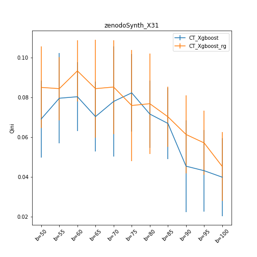
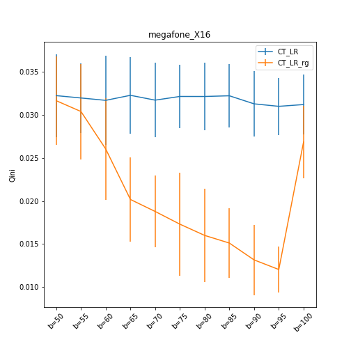

# Uplift-Modeling-With-NRA-Bias

## This repository contains the code of the paper : "Evaluation de l'uplift sur des données biaisées dans le cas du Non-Random Assignment"

You can find the code used to 1- generate biased samples     2- Treatment group reweighting with the class transformation approach and the 2 Model approach

To execute the bias generation process with a dataset:

1- The treatment and output columns should be binary (0 and 1) and named respectively : 'segment' and 'visit'  
2- Datasets variables should be discretized  

You can launch the process with the following command on a Linux machine:

#### (For the bias generation process without domain adaptation for samples reweighting):  

*ipython BiasGenAndReweighting.py DatasetFileName UpliftMethod X NoDA VAR_Name*    

#### (For the bias generation process with the reweighting method "Ratio of gaussians"):  
*ipython BiasGenAndReweighting.py DatasetFileName UpliftMethod X rg VAR_Name* 

#### For the Uplift methods, you can use :   
1- KL [[2]](#2)  
2- CTS [[3]](#3)   
3- Chi [[2]](#2)  
4- ED [[2]](#2) 
5- 2M_LR (Two Model Approach with Logistic Regression)[[4]](#4)  
6- 2M_Xgboost (Two Model Approach with Xgboost) [[4]](#4) 
7- CT_Xgboost (Class Transformation Approach with Xgboost) [[5]](#5) 
8- CT_LR (Class Transformation with Logistic Regression) [[5]](#5) 

#### For the *VAR_Name* you can use the variable name as it appears in the data, or to use "Comb" in order to generate bias using all the variables in the dataset

## Datasets and Results
In our study we used this code with the following datasets:

- *Hillstrom* [[6]](#6): Marketing dataset with 64.000 lines in total. It
contains two groups of treatments and a control group. The treatments are different marketing campaigns sent by mail, including advertisements of women's products (21.387 lines) or men's products (21.307 lines). The control group contains the individuals who did not receive a marketing campaign. A positive response is considered when the customer visits the website within two weeks after receiving the treatment (the e-mail).
In the experiments, we used the treatment of the women's products campaign and the control group.

- *Criteo* [[1]](#1): This database was created specifically for uplift prediction.
It contains 14 million individuals, where one group of individuals was targeted by an advertising campaign and another randomly selected group that was not targeted by the campaign. The treatment rate is 85%, and a visit from the customer marks a positive response.
A sample of 50.000 individuals was used.

- *Gerber* [[10]](#10): A database where we can study political behavior and the effect of social pressure to vote. Mailings were sent randomly to voters
to voters 11 days before an election in 2006. Voters who received
Neighbors' messages constitute the treatment group. In contrast, individuals who received the 'Civic Duty' message are the control group. Positive Response is considered when the voter votes.

- *Retail Hero* [[7]](#7): X5 sales group dataset that sends SMS messages to encourage people to buy more. The treatment group is the group of individuals who have been contacted by message, and the control group is the group that was not contacted.
A positive response is considered when the customer has made a purchase after being contacted.

- *Zenodo* [[8]](#8): a synthetic database containing trigonometric patterns specifically designed for uplift evaluation. We used a subset of 20,000 rows of data (data identified by the variable trial\_id = 1 and trial\_id = 2).

- *Megafon* [[9]](#9): Synthetic database was created specifically for uplift prediction. Telecom companies generated it in order to reproduce the situations encountered them.

- *Synth1* and *Synth2* : Provided in the repo.

## Following are the results of the benchmark that demonstrate the behavior of several uplift methods when facing NRA bias on the datasets cited above :

  
   
  
  

  
   
  

  
   
  

  
   
  

  
   
  

  
   
  

  
   
  

  
   
  

  
   
  

## Following is the table containing all the results :

|                | 2M_Xgboost         | CT_Xgboost | 2M_LR               | CT_LR | KL                  | ED                  | CTS       | Chi                 |
|--------------------|---------------------|-------------|--------------------|---------------------|---------------------|---------------------|-----------|---------------------|
| Criteo\_f2         | 6.6(1.7)            | 0.2(1.9)    | **7.2(1.6)** | 1.9(1.2)            | 0.6(1.4)            | 4.9(1.3)            | 2.1(1.5)  | -2.1(1.6)           |
| Criteo\_f2'        | 6.4(2.7)            | 6.9(2.0)    | 10.1(1.4)          | 7.6(1.4)            | 10.3(1.2)           | **11.0(1.2)** | 10.5(1.3) | 10.1(1.3)           |
| Criteo\_f8         | **8.1(2.6)**  | 0.1(1.7)    | 6.3(2.0)           | 1.7(1.0)            | 1.2(1.6)            | 5.2(1.2)            | 2.4(1.6)  | -1.4(1.6)           |
| Criteo\_f8'        | **7.2(2.6)**  | -2.5(1.7)   | 7.1(2.2)           | -2.0(1.3)           | -1.3(1.5)           | 4.5(1.6)            | 2.3(1.9)  | -1.9(1.7)           |
| Gerber\_p2002      | -2.4(2.0)           | -2.1(1.5)   | **1.1(1.1)** | -0.4(1.2)           | -1.5(1.8)           | -0.9(1.5)           | -0.1(1.7) | -1.5(1.8)           |
| Gerber\_p2002'     | -2.4(1.9)           | -1.5(2.2)   | 0.6(1.1)           | **1.0(1.1)**  | -0.8(1.6)           | -0.4(1.6)           | 0.1(1.6)  | -0.8(1.7)           |
| Gerber\_p2004      | -2.1(2.0)           | -1.8(1.7)   | **0.8(1.1)** | -1.2(1.3)           | -1.7(1.8)           | -1.5(1.9)           | -0.6(1.9) | -1.9(1.8)           |
| Gerber\_p2004'     | -2.4(2.0)           | -1.1(2.4)   | 1.0(1.3)           | **1.4(1.4)  | -1.3(1.3)           | -0.9(1.4)           | 0.0(1.5)  | -1.3(1.3)           |
| Hillstrom\_mens    | 2.7(2.1)            | -4.1(2.0)   | **5.5(2.6)** | -4.6(2.2)           | 2.8(2.6)            | 2.9(2.5)            | 1.0(2.8)  | 2.8(2.6)            |
| Hillstrom\_mens'   | 2.7(2.5)            | 4.6(1.5)    | 6.5(2.7)           | **6.6(1.9)**  | 4.8(2.5)            | 4.9(2.1)            | 6.0(2.1)  | 4.8(2.3)            |
| Hillstrom\_newbie  | 2.8(2.2)            | 0.1(2.1)    | **6.2(2.7)** | 2.4(1.9)            | 4.2(2.2)            | 4.3(2.5)            | 4.3(2.5)  | 4.1(2.4)            |
| Hillstrom\_newbie' | 3.6(2.6)            | 1.7(2.1)    | **6.2(2.2)** | 4.1(1.9)            | 4.7(1.9)            | 4.8(2.0)            | 4.9(2.3)  | 4.6(2.0)            |
| Megafone\_X16      | **17.8(0.5)** | 8.6(0.6)    | 3.5(0.4)           | 3.2(0.4)            | 13.2(0.5)           | 13.7(0.5)           | 11.6(0.7) | 13.2(0.4)           |
| Megafone\_X16'     | **18.0(0.4)** | 14.2(0.5)   | 3.6(0.4)           | 3.1(0.5)            | 13.5(0.5)           | 13.7(0.5)           | 12.2(0.6) | 13.4(0.6)           |
| Megafone\_X21      | **18.2(0.4)** | 12.0(0.4)   | 3.5(0.4)           | 2.4(0.5)            | 13.9(0.5)           | 14.0(0.6)           | 10.7(0.8) | 13.7(0.5)           |
| Megafone\_X21'     | **18.2(0.5)** | 12.8(0.4)   | 3.3(0.6)           | 1.8(0.6)            | 13.6(0.5)           | 13.9(0.5)           | 11.9(0.6) | 13.5(0.5)           |
| Synth1             | 7.0(0.9)            | 1.7(0.9)    | 0.9(1.6)           | -2.9(1.3)           | **9.7(1.2)**  | 8.8(1.6)            | 8.7(1.2)  | 9.6(1.8)            |
| Synth1'            | 9.5(1.5)            | -0.4(3.0)   | 2.1(0.7)           | -0.8(2.8)           | 12.0(1.9)           | 11.1(2.3)           | 10.4(1.8) | **12.5(1.9)** |
| Synth2             | 9.8(0.1)            | 8.1(0.5)    | 1.9(0.1)           | 1.1(0.2)            | 9.7(0.1)            | 9.6(0.2)            | 8.7(0.1)  | **9.9(0.2)**  |
| Synth2'            | **10.0(0.1)** | 8.6(0.1)    | 1.7(0.0)           | 1.4(0.4)            | 9.8(0.1)            | 9.5(0.2)            | 8.8(0.2)  | 9.9(0.1)            |
| retailHero\_age    | 0.7(0.4)            | 0.3(0.4)    | **1.2(0.3)** | 0.8(0.4)            | 0.8(0.3)            | 0.9(0.3)            | 0.9(0.4)  | 0.9(0.3)            |
| retailHero\_age'   | 0.7(0.5)            | 0.6(0.4)    | 1.2(0.3)           | **1.3(0.4)**  | 0.9(0.4)            | 0.9(0.4)            | 0.6(0.5)  | 0.9(0.4)            |
| retailHero\_trNum  | 0.8(0.4)            | 0.4(0.3)    | **1.2(0.3)** | 1.1(0.4)            | 0.7(0.4)            | 0.7(0.4)            | 0.6(0.4)  | 0.7(0.4)            |
| retailHero\_trNum' | 0.8(0.4)            | 0.5(0.4)    | **1.2(0.4)** | 1.1(0.4)            | 0.6(0.4)            | 0.6(0.5)            | 0.3(0.4)  | 0.6(0.4)            |
| zenodoSynth\_X10   | 9.7(1.8)            | 7.0(2.2)    | 12.6(1.9)          | 12.1(1.5)           | 12.8(1.9)           | **13.0(1.9)** | 10.6(2.6) | 12.8(1.8)           |
| zenodoSynth\_X10'  | 9.5(2.1)            | 6.9(2.1)    | 12.6(1.8)          | 12.0(1.7)           | **13.5(2.4)** | **13.5(2.4)** | 10.7(2.5) | 13.3(2.4)           |
| zenodoSynth\_X31   | 9.8(2.4)            | 6.6(2.0)    | 12.2(2.0)          | 12.0(1.9)           | 12.7(1.9)           | **13.2(2.0)** | 10.2(2.2) | 12.8(1.8)           |
| zenodoSynth\_X31'  | 9.5(2.4)            | 9.2(2.0)    | 12.2(1.8)          | 11.8(1.5)           | 13.0(2.5)           | **13.4(2.3)** | 12.1(2.1) | 13.0(2.4)           |

## Following are the results of the treatment samples reweighting for the class transformation approach (with Logistic regression and Xgboost):
*The reweighted method is marked in orange and the standard method in blue*

  
   
  
  

  
   
  

  
   
  

  
   
  

  
   
  

  
   
  

  
   
  

  
   
  

  
   
  

  
   
  
  

  
   
  

  
   
  

  
   
  

  
   
  

  
   
  

  
   
  

  
   
  

  
   
  

## Below are the numerical results presenting the average qini for each method (without and with reweighting):

|                  | CT_LR              | CT_LR_rg           |
|--------------------|---------------------|---------------------|
| Criteo\_f2         | 1.9(1.2)            | **10.2(0.9)** |
| Criteo\_f2'        | 7.6(1.4)            | **9.4(1.3)**  |
| Criteo\_f8         | 1.7(1.0)            | **10.0(0.8)** |
| Criteo\_f8'        | -2.0(1.3)           | **10.1(0.9)** |
| Gerber\_p2002      | -0.4(1.2)           | **1.2(0.9)**  |
| Gerber\_p2002'     | 1.0(1.1)            | **1.1(1.2)**  |
| Gerber\_p2004      | -1.2(1.3)           | **1.2(1.1)**  |
| Gerber\_p2004'     | **1.4(1.4)**  | 1.0(1.3)            |
| Hillstrom\_mens    | -4.6(2.2)           | **2.1(2.4)**  |
| Hillstrom\_mens'   | \bfseries 6.6(1.9)  | 6.0(2.0)            |
| Hillstrom\_newbie  | 2.4(1.9)            | ** 5.1(2.1)**  |
| Hillstrom\_newbie' | 4.1(1.9)            | **4.3(1.9)**  |
| Megafone\_X16      | \bfseries 3.2(0.4)  | 2.1(0.5)            |
| Megafone\_X16'     | 3.1(0.5)            | **3.3(0.4)**  |
| Megafone\_X21      | \bfseries 2.4(0.5)  | **2.4(0.5)**  |
| Megafone\_X21'     | 1.8(0.6)            | **1.9(0.6)**  |
| Synth1             | -2.9(1.3)           | **1.2(2.1)**  |
| Synth1'            | -0.8(2.8)           | **0.4(1.4)**  |
| Synth2             | 1.1(0.2)            | **1.8(0.0)**  |
| Synth2'            | 1.4(0.4)            | **1.8(0.1)**  |
| retailHero\_age    | **0.8(0.4)**  | 0.7(0.5)            |
| retailHero\_age'   | **1.3(0.4)**  | 0.1(0.9)            |
| retailHero\_trNum  | **1.1(0.4)**  | 0.5(0.8)            |
| retailHero\_trNum' | **1.1(0.4)** | 0.8(0.5)            |
| zenodoSynth\_X10   | **12.1(1.5)** | **12.1(1.9)** |
| zenodoSynth\_X10'  | 12.0(1.7)           | **12.2(1.9)** |
| zenodoSynth\_X31   | 12.0(1.9)           | **12.2(1.9)** |
| zenodoSynth\_X31'  | 11.8(1.5)           | **12.0(2.0)** |

|                 | CT_Xgboost         | CT_Xgboost_rg      |
|--------------------|---------------------|---------------------|
| Criteo\_f2         | 0.2(1.9)            | **8.9(0.9)**  |
| Criteo\_f2'        | 6.9(2.0)            | **9.5(1.2)**  |
| Criteo\_f8         | 0.1(1.7)            | **8.8(1.0)**  |
| Criteo\_f8'        | -2.5(1.7)           | **8.7(1.1)**  |
| Gerber\_p2002      | -2.1(1.5)           | **1.2(2.0)** |
| Gerber\_p2002'     | **-1.5(2.2)** | **-1.5(2.0)** |
| Gerber\_p2004      | -1.8(1.7)           | **-1.5(2.0)** |
| Gerber\_p2004'     | -1.1(2.4)           | **-0.8(2.3)** |
| Hillstrom\_mens    | -4.1(2.0)           | **0.3(2.3)**  |
| Hillstrom\_mens'   | **4.6(1.5)**  | 3.0(1.8)            |
| Hillstrom\_newbie  | 0.1(2.1)            | **1.5(2.7)**  |
| Hillstrom\_newbie' | **1.7(2.1)**  | 0.8(2.2)            |
| Megafone\_X16      | 8.6(0.6)            | **11.8(0.5)** |
| Megafone\_X16'     | 14.2(0.5)           | **14.4(0.5)** |
| Megafone\_X21      | 12.0(0.4)           | **13.1(0.4)** |
| Megafone\_X21'     | 12.8(0.4)           | **13.8(0.5)** |
| Synth1             | 1.7(0.9)            | **3.8(0.6)**  |
| Synth1'            | -0.4(3.0)           | **0.3(2.4)**  |
| Synth2             | 8.1(0.5)            | **8.3(0.7)**  |
| Synth2'            | 8.6(0.1)            | **8.8(0.2)**  |
| retailHero\_age    | **0.3(0.4)**  | 0.2(0.5)            |
| retailHero\_age'   | 0.6(0.4)            | **0.7(0.5)**  |
| retailHero\_trNum  | **0.4(0.3)**  | 0.3(0.4)            |
| retailHero\_trNum' | **0.5(0.4)**  | **0.5(0.4)**  |
| zenodoSynth\_X10   | 7.0(2.2)            | **7.5(2.1)**  |
| zenodoSynth\_X10'  | 6.9(2.1)            | **7.7(1.9)**  |
| zenodoSynth\_X31   | 6.6(2.0)            | **7.4(2.0)**  |
| zenodoSynth\_X31'  | **9.2(2.0)**  | 8.5(2.1)            |

# References
<a id="1">[1]</a> 
Diemert, Eustache and Betlei, Artem and Renaudin, Christophe and Amini, Massih-Reza. 
A Large Scale Benchmark for Uplift Modeling. 
KDD.

<a id="2">[2]</a> 
Rzepakowski, Piotr. 
Decision trees for uplift modeling with single and multiple treatments. 
Knowledge and Information Systems.

<a id="3">[3]</a> 
Zhao, Yan, Xiao Fang, and David Simchi-Levi. 
Uplift modeling with multiple treatments and general response types. 
Proceedings of the 2017 SIAM International Conference on Data Mining. Society for Industrial and Applied Mathematics, 2017.

<a id="4">[4]</a> 
Radcliffe, Nicholas J., and Patrick D. Surry. 
Real-world uplift modelling with significance-based uplift trees. 
White Paper TR-2011-1, Stochastic Solutions (2011): 1-33.

<a id="5">[5]</a> 
Jaskowski, Maciej and Jaroszewicz, Szymon
Uplift modeling for clinical trial data
ICML Workshop on Clinical Data Analysis (2012)

<a id="6">[6]</a> 
Hillstrom
https://blog.minethatdata.com/2008/03/minethatdata-e-mail-analytics-and-data.html

<a id="7">[7]</a> 
Retail Hero X5
https://ods.ai/competitions/x5-retailhero-uplift-modeling/data

<a id="8">[8]</a> 
Zenodo
https://zenodo.org/record/3653141#.YY0L_-dCcc8

<a id="9">[9]</a> 
Megafon
https://ods.ai/tracks/df21-megafon/competitions/megafon-df21-comp/data

<a id="10">[10]</a> 
Alan S. Gerber and Donald P. Green and Christopher W. Larimer2
Social Pressure and Voter Turnout: Evidence from a Large-Scale Field Experiment
The American Political Science Review (2008)
